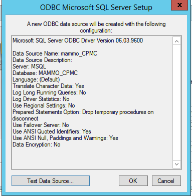

# 3CB setup and processing

## Database

This database setup assumes the server and software are running in a Microsoft Windows environment.

Steps
1. Create a Microsoft SQL server with the database name:
MSQL
2. Use ODBC Microsoft SQL Server Setup to connect to the database using the data source name:
mammo_CPMC

3. _add more_